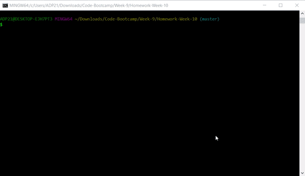

# Node Hangman 



### To Use This Game

```
git clone https://github.com/krosenk729/Nodman.git
cd Nodeman
npm install
node app.js
```

### Game Logic

When setting up a new game
1. Get a new word 
2. Clear the list of past guesses

When a guess is triggered
1. Ensure guess is a valid key/character (if not, end)
2. Check guess is new (if not, end)
3. Check for guess within letters 
3.A If guess is found, letters should be flipped
3.B If guess is found, check to see if this wins the game 
3.C If game is won: tell user, increment wins and reset game
4. Check to see if this ends the game
4.A If lost game: tell user, increment losses and reset game
